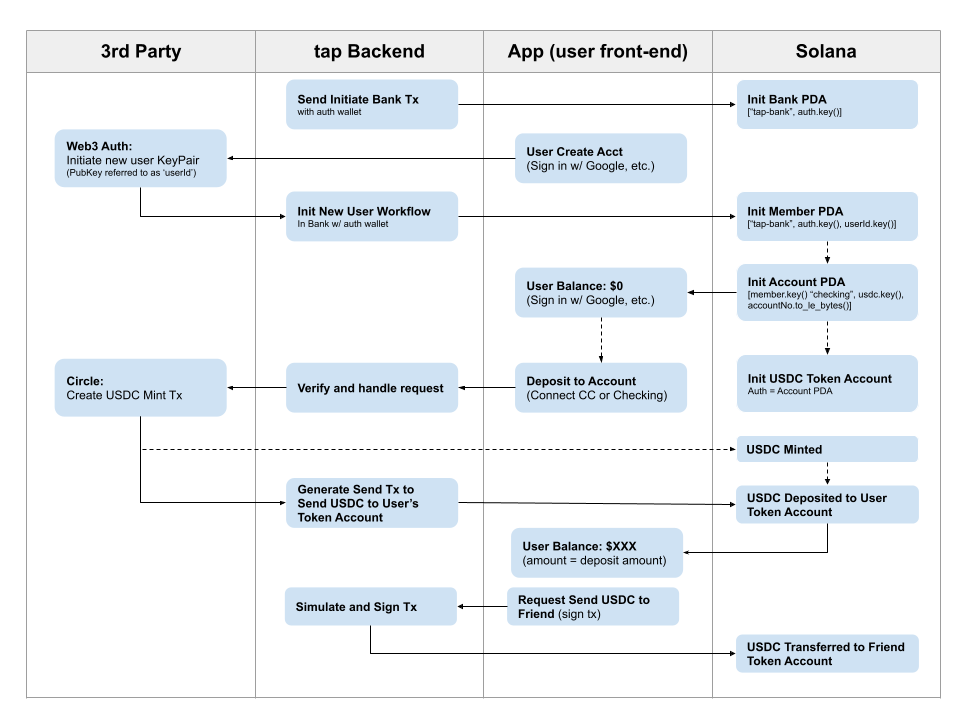

# tap
*digital cash, for everyone*. **tap** is a user-first mobile cash app designed for mainstream adoption.

Submission to 2023 Solana Grizzlython Submission by: 
- Aaron Milano (amilz) ([GitHub](https://github.com/amilz), [LinkedIn](https://www.linkedin.com/in/aaronmilano/))  
- Austin Milt ([GitHub](https://github.com/austinmilt), [LinkedIn](https://www.linkedin.com/in/austinmilt/)) 
- Special Thanks to [Matcha Design Labs](https://www.matchadesignlabs.com/) for 🔥 UI/UX design work 

#### Resources
- [Pitch Deck](https://docs.google.com/presentation/d/1_u_i_yqSlY2ZjhBJsdlTOUyJ7z1OH891Pro1LJQSPpA/edit#slide=id.g2196631c208_1_103) 
- [Android APK Download](https://todo)
- [Technical README for Building Locally](./README-DEV.md)
- [tap HomePage](https://tapcash.app)
- [tap Twitter](https://twitter.com/tapcashapp)

#### Summary of Submission Features
- SSO with Gmail
- Multi-sig custodial “checking” account
- Credit Card onramp
- Feeless peer-to-peer transfers
- Parsed Solana Transactions Activity Feed
- Live on Solana Devnet
- Live on Android

#### Tech Stack
- Anchor: [Bank program](./program/tap_cash/) that manages user accounts and multi-sign USDC wallets
    - TypeScript: [Program SDK](./backend/src/program/sdk.ts)
- Web3 Auth SDK: Single sign-in with Google and non-custodial signing wallet
- React-Native: [mobile UI/UX](./src/)
- Circle SDK: [Credit Card on-ramp](./backend/src/circle/)
- Google Firestore: [Database](./backend/src/db/) for storing user public info
- Google Cloud Functions: [Serverless API backend](./backend/src/index.ts) 
- Landing Page: [NextJs](https://tapcash.app)

#### Detailed User Flow
**New Users** 

Users create an account by logging in with gmail account. 
- Users are authenticated and receive a custodial Solana wallet via [Web3 Auth](https://web3auth.io/). 
- On account initiation, the tap program ([Devnet](https://explorer.solana.com/address/TAPAPp2YoguQQDkicGyzTzkA3t4AgECvR1eL1hbx9qz?cluster=devnet): `TAPAPp2YoguQQDkicGyzTzkA3t4AgECvR1eL1hbx9qz`) initiates a new Member PDA for the [Tap "Bank"](https://explorer.solana.com/address/AU88yciXy2Rz2DJkUUFu2gpYqaPRLngd3sevSfAH8KyS/anchor-account?cluster=devnet). 
- A user "Checking" account is created (seeded on the member PDA), and a USDC ATA owned by the member account is initiated. 
- All initiation fees and rent are paid by the Tap Bank. 

**Deposits**

- Users deposit funds to their account a credit card using the Circle payments API
- Currently, devnet assigns a random credit card to the user (manual credit card entry is disabled)
- On confirmation of payment, funds are transferred from tap account to users USDC token account
- Balance is updated on users homepage and the transaction on recent activity (custom parsed Solana transaction history)

**Transfers**

- Users can initiate a peer to peer transfer via the "Send" button on the home page. 
- Users query other tap members via a search that looks up other members via our Google Backend.
- Users select a user and amount and send the transaction to our backend.
- The program transfer function requires 3 signatures: the Program, the tap Bank authority, and the user.
- Once the transaction is confirmed on chain, balance and transfer are updated on the user homepage.

#### Present Limitations/Known Issues
- Some features currently disabled on devnet: 
    - Cash withdrawals
    - Add/remove payment methods (we use random dummy credit cards for devnet)
- Currently in-app transfers limited to other users on the platform. This is intentional for early release, but not a limitation of our future capabilities. In an effort to simplify the UX, we are activity avoiding introducing any reference to crypto, blockchain, public/secret keys, gas, Solana, etc.
- Similarly, because tap is targetted to a non-crypto native user, we did not build in the seed vault or incorporate exporting secret keys (though these are features that can easily be added at a later date when customer's are ready for such features)
- Current demo is limited to Android, however since we built with React Native, we should be able to add iOS in the near future